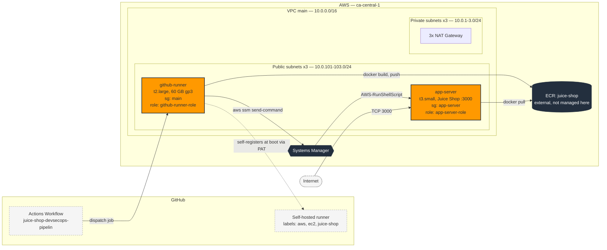
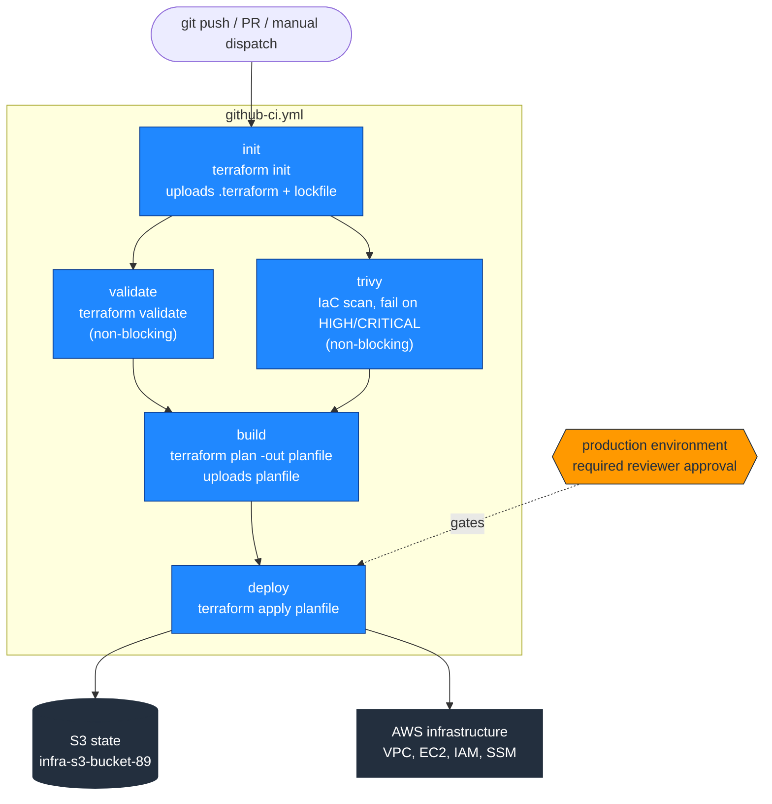
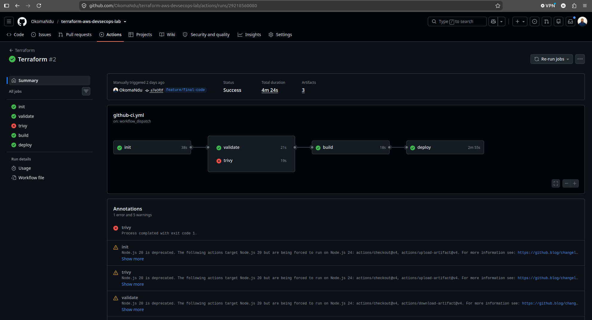
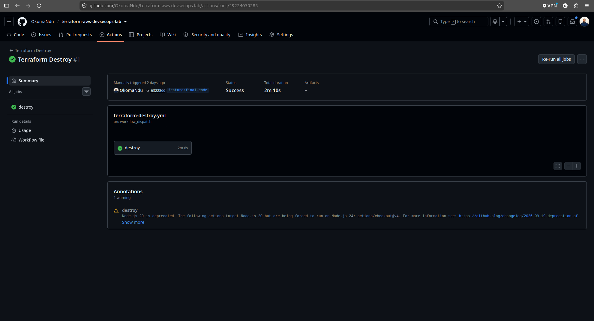
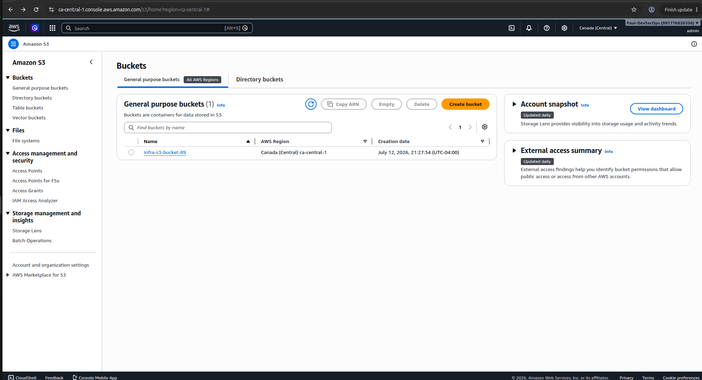

# infra-automation

Terraform IaC that provisions the AWS infrastructure for the **juice-shop DevSecOps pipeline**: a build/CI host (self-hosted GitHub Actions runner) and an application host that runs the OWASP Juice Shop container pulled from ECR.

The two hosts are deliberately split:

| Host | Role in the pipeline |
| --- | --- |
| **github-runner** | Executes GitHub Actions jobs — builds the Juice Shop image, runs security scans, pushes to ECR. |
| **app-server** | Deployment target. Receives `docker pull`/`docker run` instructions **over AWS SSM** (no SSH, no inbound ports). |

---

## Architecture



> **ECR is an external dependency** — the `juice-shop` repository is *not* created by this Terraform config.

**Deployment is SSH-less by design.** The pipeline never opens port 22 or holds an SSH key — it drives the app-server through `aws ssm send-command`, authenticated by IAM. Both instances register with SSM via `AmazonSSMManagedInstanceCore`.

---

## Versions

**Provider**
- `hashicorp/aws` `~> 6.54.0`

**Modules**
- `terraform-aws-modules/vpc/aws` `6.6.0`
- `terraform-aws-modules/ec2-instance/aws` `6.4.0`

Both instances use the Canonical AMI `ubuntu/images/hvm-ssd/ubuntu-jammy-22.04-amd64-*` (Ubuntu 22.04), resolved dynamically at plan time by `data.aws_ami.ubuntu`.

---

## Resources created

**IAM**
- Role `app-server-role` → instance profile `app-server-role`
  - `AmazonSSMManagedInstanceCore` — lets the SSM agent register + accept commands
  - `AmazonEC2ContainerRegistryFullAccess` — pull images from ECR
- Role `github-runner-role` → instance profile `github-runner-role`
  - `AmazonSSMManagedInstanceCore` — required for SSM agent registration
  - `AmazonSSMFullAccess` — lets the runner issue `ssm send-command` to the app-server
  - `AmazonEC2ContainerRegistryFullAccess` — push images to ECR

**Networking**
- VPC `main` — `10.0.0.0/16`, 3 public + 3 private subnets across all AZs, NAT gateways, VPN gateway
- Security group `main` — all traffic from `10.0.0.0/16`; all egress. Used by github-runner.
- Security group `app-server` — all traffic from `10.0.0.0/16`, **TCP 3000 from `0.0.0.0/0`** (Juice Shop UI); all egress.

**Compute**
- `module.ec2_app_server` — `t3.small`, public subnet, `app-server` SG, `app-server-role`
- `module.ec2_github_runner` — `t2.large`, 60 GB gp3 root volume, public subnet, `main` SG, `github-runner-role`, `user_data_replace_on_change = true`

---

## Bootstrap scripts (`scripts/`)

Rendered by `templatefile()` in `locals.tf` and passed as EC2 `user_data`. Cloud-init runs them as **root** on first boot only.

### `script.tpl` → app-server
Installs Docker and the AWS CLI, adds `ubuntu` to the `docker` group. Nothing else — the app-server is a passive target; the pipeline drives it over SSM.

### `script-github.tpl` → github-runner
Fully unattended self-hosted runner registration:

1. Installs Docker, AWS CLI v2, `jq`.
2. **Mints a fresh runner registration token at every boot** by calling
   `POST /repos/{owner}/{repo}/actions/runners/registration-token` with the `github_pat`.
3. Runs `config.sh --unattended --replace` **as the `ubuntu` user** (the GitHub runner refuses to configure as root), with labels `aws,ec2,juice-shop`.
4. Installs and starts the runner as a systemd service (`svc.sh install ubuntu`).
5. Logs everything to **`/var/log/github-runner-setup.log`** and exits non-zero if the token call fails.

> **Why a PAT and not a registration token?** GitHub registration tokens are **single-use and expire in ~1 hour**, so one hard-coded in `terraform.tfvars` cannot survive an instance replacement. The instance mints its own token on each boot, which is what makes `terraform apply` fully self-contained — no manual `config.sh`, no SSH.

---

## Prerequisites

### 1. The `iac-user` IAM user

Terraform authenticates as a dedicated IAM user, **`iac-user`**, with an access key. Attached policies:

| Policy | Why it's needed |
| --- | --- |
| `AmazonEC2FullAccess` | EC2 instances, VPC, subnets, route tables, gateways, security groups |
| `IAMFullAccess` | Create the roles, policy attachments, and instance profiles |
| `AmazonSSMReadOnlyAccess` | The ec2-instance module reads the SSM public parameter for the default AMI |
| `AmazonS3FullAccess` | Read/write the Terraform state object in the S3 backend bucket |

> ⚠️ `IAMFullAccess` and `AmazonS3FullAccess` are both very broad. `IAMFullAccess` permits privilege escalation; `AmazonS3FullAccess` grants access to *every* bucket in the account, not just the state bucket. Acceptable for a lab — see [Security notes](#security-notes) for the least-privilege alternatives before reusing this pattern.

### 2. The S3 state backend (created manually)

State is stored remotely in S3 (see [providers.tf](providers.tf)) so that CI runs on ephemeral runners share one authoritative state:

```hcl
backend "s3" {
  bucket       = "infra-s3-bucket-89"
  key          = "infra/state.tfstate"
  region       = "ca-central-1"
  encrypt      = true          # state holds the PAT + AWS keys in plaintext
  use_lockfile = true          # S3-native state locking (Terraform >= 1.10)
}
```

The bucket **`infra-s3-bucket-89`** is created **out-of-band in the AWS console** — a backend cannot bootstrap the bucket that holds its own state. Create it once (with **versioning** and **Block Public Access** enabled), then `terraform init` uses it. It is intentionally *not* managed by this Terraform and survives `terraform destroy`.

### 3. A GitHub Personal Access Token

Used by the runner to mint registration tokens.

- **Fine-grained** (preferred): scoped to the `juice-shop-devsecops-pipelin` repo, permission **Repository → Administration: Read and write**.
- **Classic**: `repo` scope.

---

## Configuration

Create **`terraform.tfvars`** in the project root (it is git-ignored — see [Security notes](#security-notes)):

```hcl
aws_access_key_id     = "AKIA..."           # iac-user access key
aws_secret_access_key = "..."               # iac-user secret
github_pat            = "github_pat_11..."  # PAT with repo Administration: RW
```

### Declared variables (`variables.tf`)

| Variable | Default | Sensitive | Description |
| --- | --- | :---: | --- |
| `aws_access_key_id` | `""` | | `iac-user` access key ID |
| `aws_secret_access_key` | `""` | | `iac-user` secret access key |
| `aws_region` | `ca-central-1` | | Target region |
| `env_prefix` | `dev` | | Applied as the `environment` default tag |
| `github_pat` | `""` | ✅ | PAT used to mint runner registration tokens |
| `github_owner` | `OkomaNdu` | | GitHub org/user that owns the repo |
| `github_repo` | `juice-shop-devsecops-pipelin` | | Repo the runner registers against |

`variables.tf` *declares* variables; `terraform.tfvars` *assigns* them — including secrets, so it stays local and is never committed.

---

## Usage

**The pipeline is the primary path** — apply and destroy run through GitHub Actions (see [CI/CD pipeline](#cicd-pipeline)), so every change uses the same credentials, Terraform version, remote state, and approval gate. Prefer that over running from a laptop.

For local work (planning, debugging), the commands are:

```bash
# Initialise providers, modules, and the S3 backend
terraform init

# Preview
terraform plan -var-file terraform.tfvars

# Apply
terraform apply -var-file terraform.tfvars

# Tear everything down
terraform destroy -var-file terraform.tfvars

# show resources and components from current state
terraform state list
```

> **The S3 backend does not read `terraform.tfvars`.** A backend authenticates only through the standard AWS credential chain, so locally you must export credentials before `init` — otherwise you get `InvalidClientTokenId`:
> ```bash
> export AWS_ACCESS_KEY_ID=... AWS_SECRET_ACCESS_KEY=... AWS_DEFAULT_REGION=ca-central-1
> ```

After apply, allow ~2–3 minutes for cloud-init, then confirm the runner is **Idle** at
*Repo → Settings → Actions → Runners*. It registers itself; there is nothing to do by hand.

### Useful checks

```bash
# Which instances does SSM actually manage?
aws ssm describe-instance-information --region ca-central-1 \
  --query "InstanceInformationList[].[InstanceId,PingStatus]" --output table

# Confirm the runner's root volume
terraform state show 'module.ec2_github_runner.aws_instance.this[0]' | grep -A 12 root_block_device

# Read the runner bootstrap log (no SSH — SSM only)
aws ssm start-session --target <instance-id> --region ca-central-1
sudo cat /var/log/github-runner-setup.log
```

### Forcing a rebuild of the runner

`user_data_replace_on_change = true` means **any edit to `script-github.tpl` replaces the instance**, so the new script actually runs. Editing `user_data` *without* replacement would only update the attribute — cloud-init runs on first boot only and would never re-execute it.

Changes that do *not* alter `user_data` (e.g. volume size) update in-place and do **not** re-run the script. To force a fresh boot:

```bash
terraform apply -replace='module.ec2_github_runner.aws_instance.this[0]' -var-file terraform.tfvars
```

---

## CI/CD pipeline

Terraform is driven entirely through GitHub Actions — no one runs `apply` from a laptop. Two workflows live in [.github/workflows/](.github/workflows/):

| Workflow | File | Trigger | Purpose |
| --- | --- | --- | --- |
| **Terraform** | `github-ci.yml` | every `push`, `pull_request`, or manual | Init → validate → scan → plan → **gated apply** |
| **Terraform Destroy** | `terraform-destroy.yml` | manual **only** | Gated, confirmed teardown of all infrastructure |

### Process flow



State is shared between jobs two ways: **artifacts** carry the initialised `.terraform/` dir and the `planfile` from job to job (each job runs on a fresh, isolated runner), while the **S3 backend** holds the authoritative Terraform state.

### `github-ci.yml` jobs

1. **init** — `terraform init` (configures the S3 backend), uploads `.terraform/` + `.terraform.lock.hcl` as an artifact. `include-hidden-files: true` is required because both are dot-prefixed and `upload-artifact` skips hidden files by default.
2. **validate** — downloads the artifact, `chmod +x` the provider binary (artifacts drop the exec bit), runs `terraform validate`.
3. **trivy** — scans the IaC for misconfigurations, fails on HIGH/CRITICAL, uploads the JSON report.
4. **build** — `terraform plan -out planfile`, uploads the planfile.
5. **deploy** — applies the **exact** planfile from `build`, so what ships is what was reviewed. Gated by the `production` environment.

> **The apply gate.** `deploy` declares `environment: production`. Configure that environment (*Settings → Environments → production*) with **required reviewers** so the job pauses for human approval before touching AWS. This is the GitHub equivalent of GitLab's `when: manual`. Without required reviewers, `apply` runs unattended on every push.

### `terraform-destroy.yml`

A deliberately separate, **manual-only** workflow — teardown must never be reachable from an automatic trigger. Three safeguards stack:

1. `workflow_dispatch` only — no `push`/`pull_request`.
2. A typed **`DESTROY`** confirmation input; the job fails immediately on any other value.
3. The same `production` environment approval gate as `deploy`.

It runs `terraform plan -destroy` first (preview in the log), then `terraform destroy -auto-approve`.

**To tear down:** *Actions → Terraform Destroy → Run workflow →* type `DESTROY` *→ approve the environment.*

> Because `workflow_dispatch` workflows only appear in the Actions UI when present on the repository's **default branch**, make sure this file is on the default branch or you won't see a **Run workflow** button.

### Pipeline in action

**CI pipeline run** — `init → validate/trivy → build → deploy`. Note `trivy` reporting a finding (red) while the pipeline continues, because the job is currently `continue-on-error`:



**Gated destroy** — `Terraform Destroy` completed successfully via `workflow_dispatch`:



**Remote state bucket** — `infra-s3-bucket-89`, created manually in the S3 console and preserved after `terraform destroy`:



### GitHub Actions configuration

Set on the pipeline repository (*Settings → Secrets and variables → Actions*):

| Kind | Name | Value |
| --- | --- | --- |
| Secret | `AWS_ACCESS_KEY_ID` | `iac-user` access key ID |
| Secret | `AWS_SECRET_ACCESS_KEY` | `iac-user` secret |
| Secret | `GH_RUNNER_PAT` | GitHub PAT (repo Administration: RW) |
| Variable | `AWS_DEFAULT_REGION` | `ca-central-1` |

> The PAT secret must **not** start with `GITHUB_` — that prefix is reserved — hence `GH_RUNNER_PAT`.

---

## Gotchas worth knowing

**`root_block_device` uses `size` / `type`, not `volume_size` / `volume_type`.**
In ec2-instance module v6 this is a typed *object*. Terraform **silently discards** unrecognised attributes — no error, no plan diff — so a block using the v5 names is ignored entirely and the instance falls back to the AMI default (**8 GB gp2**). Always verify with `terraform state show`.

**Growing an EBS volume in place does not grow the filesystem.**
An in-place resize leaves the partition and filesystem at their old size, and Docker builds die with `no space left on device`. Replacing the instance avoids this entirely: cloud-init runs `growpart` on first boot. Prefer `-replace` over resizing a live CI host.

**`AmazonSSMFullAccess` does not let the SSM *agent* register.**
It grants the `ssm:*` **API** to a caller, but the agent needs `ssmmessages:*` / `ec2messages:*` to open a Session Manager channel — those come from `AmazonSSMManagedInstanceCore`. Without it: `Ping status: -`, "Not connected", and `send-command` fails with `InvalidInstanceId`. Both roles now carry `ManagedInstanceCore`.

**Never hard-code instance IDs in the pipeline.**
Every replacement mints a new ID, and a stale one fails with `InvalidInstanceId — Instances not in a valid state for account`. Resolve by tag instead:

```bash
INSTANCE_ID=$(aws ec2 describe-instances \
  --filters "Name=tag:Name,Values=app-server" "Name=instance-state-name,Values=running" \
  --query "Reservations[].Instances[].InstanceId" --output text)
```

---

## Cost warning

`enable_nat_gateway = true` provisions **3 NAT Gateways** (one per AZ), which bill hourly plus data processing whether or not they carry traffic. They are typically the largest line item in this stack. Run `terraform destroy` when the lab is idle.
